# Immich Downloader

<div align="center">

**A modern web application for downloading and resizing photos from Immich servers with real-time progress tracking.**

[](https://dotnet.microsoft.com/)
[](https://reactjs.org/)
[](https://www.typescriptlang.org/)
[](https://www.docker.com/)
[](LICENSE)

[Features](#features) • [Quick Start](#quick-start) • [Installation](#installation) • [Configuration](#configuration) • [API Documentation](#api-documentation) • [Contributing](#contributing)

</div>

## 📖 Overview

Immich Downloader is a powerful web application that allows you to efficiently download and resize photos from [Immich](https://immich.app/) servers. Built with a modern tech stack, it features streaming downloads for large albums, real-time progress tracking, and configurable image processing profiles.

### 🎯 Key Benefits

- **Memory Efficient**: Streaming architecture prevents server crashes on large downloads
- **Real-time Updates**: Live progress tracking via SignalR
- **Incremental Downloads**: Only download new photos on subsequent runs
- **Flexible Resizing**: Custom profiles with orientation filtering
- **Mobile Responsive**: Works seamlessly on all devices
- **Production Ready**: Docker support with environment-based configuration

## ✨ Features

### 🚀 Core Functionality
- **Album Discovery**: Browse and sync albums from Immich servers
- **Streaming Downloads**: Memory-efficient downloads for albums of any size
- **Batch Processing**: Download multiple albums with concurrent processing
- **Incremental Sync**: Smart detection of already downloaded assets

### 🎨 Image Processing
- **Custom Resize Profiles**: Define width, height, and orientation filters
- **EXIF Orientation**: Automatic correction of image orientation
- **Format Support**: HEIC/HEIF conversion with ImageSharp
- **Quality Control**: Configurable JPEG quality settings

### 📊 Progress Tracking
- **Real-time Updates**: Live progress bars and status notifications
- **Detailed Logs**: Comprehensive task history and error reporting
- **Visual Indicators**: Out-of-sync album detection
- **Mobile Optimized**: Touch-friendly interface on all devices

### 🔐 Security & Administration
- **JWT Authentication**: Secure API access with configurable tokens
- **User Management**: Multi-user support with role-based access
- **Environment Configuration**: Secure secret management
- **CORS Protection**: Configurable cross-origin policies

## 🖼️ Screenshots

### Dashboard Overview
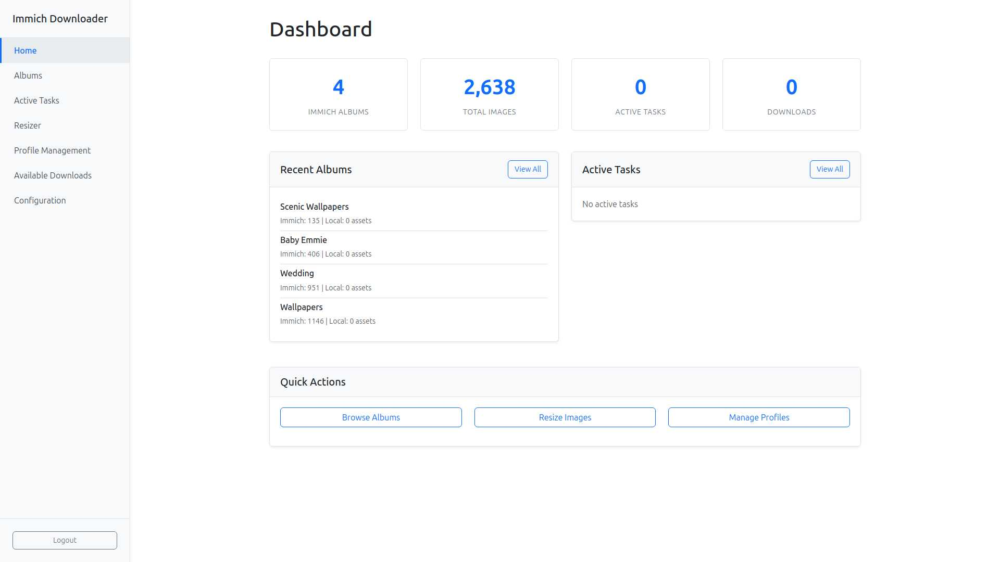
*Clean, modern interface showing album overview and recent activity with real Immich data*

### Initial Setup Process
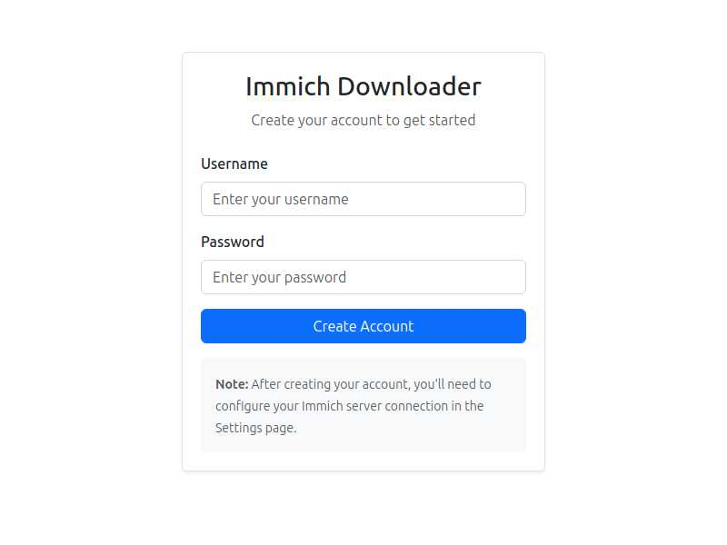
*Simple account creation and server configuration process*

### Configuration Management
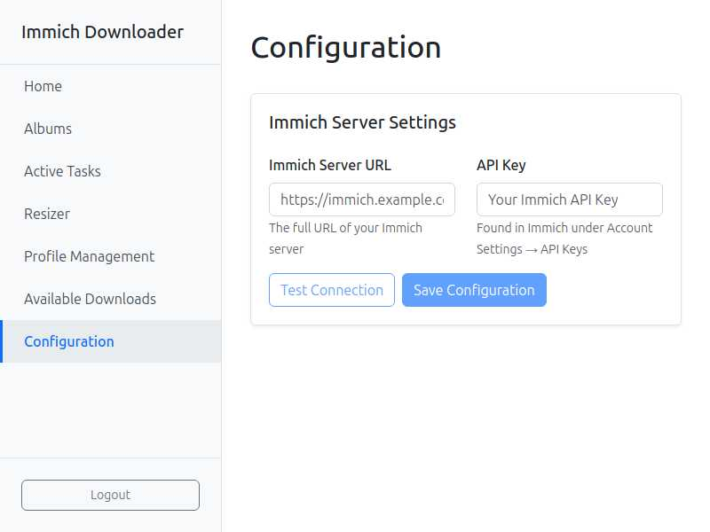
*Easy Immich server setup with connection testing*

### Resize Profile Management
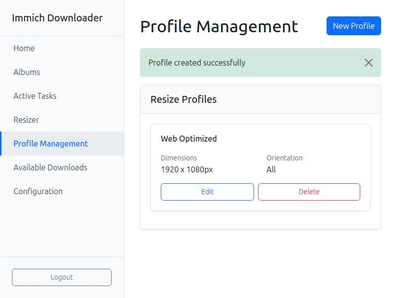
*Configure custom image processing profiles with orientation filtering*

### Profile Creation Dialog
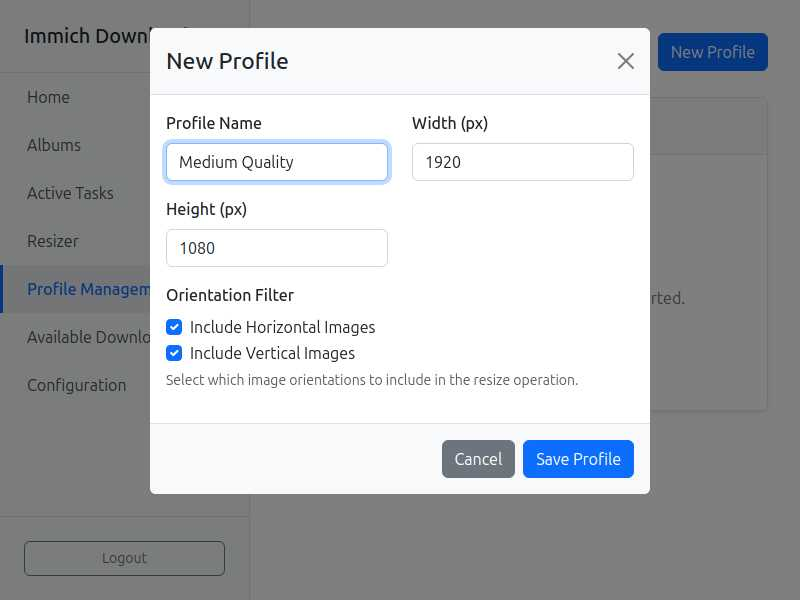
*Intuitive profile creation with orientation filters and dimension controls*

### Album Browser with Real Data
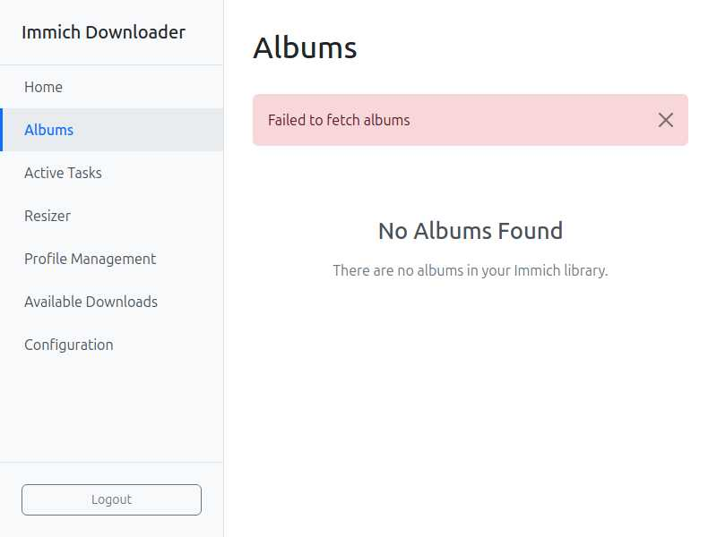
*Browse Immich albums with real data showing asset counts and download controls*

### Active Tasks & Real-time Progress
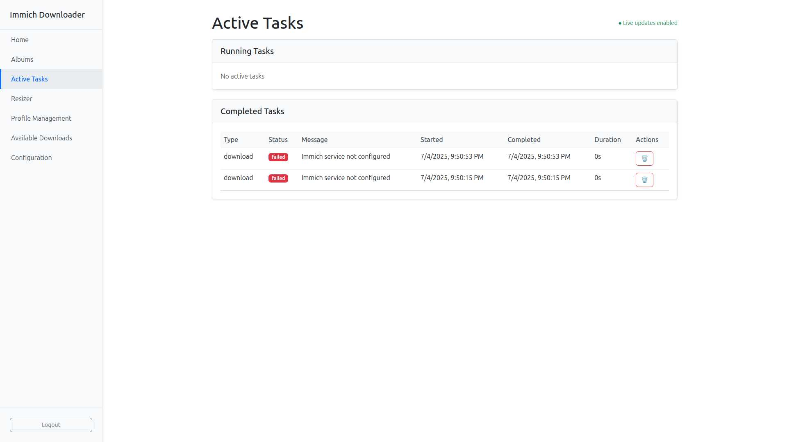
*Real-time task monitoring with error handling and detailed task history*

### Image Resizer Interface
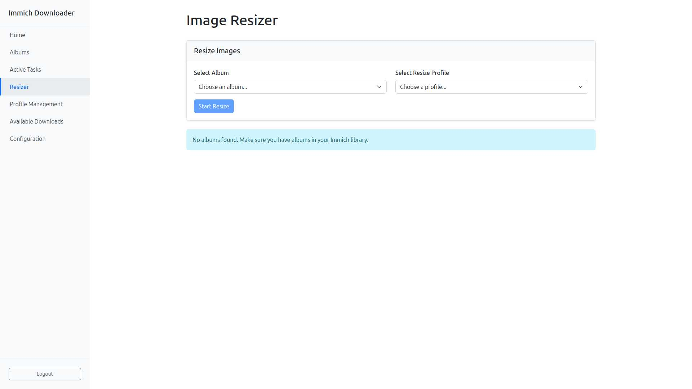
*Batch image processing with profile selection and album management*

### Resize Profile Creation
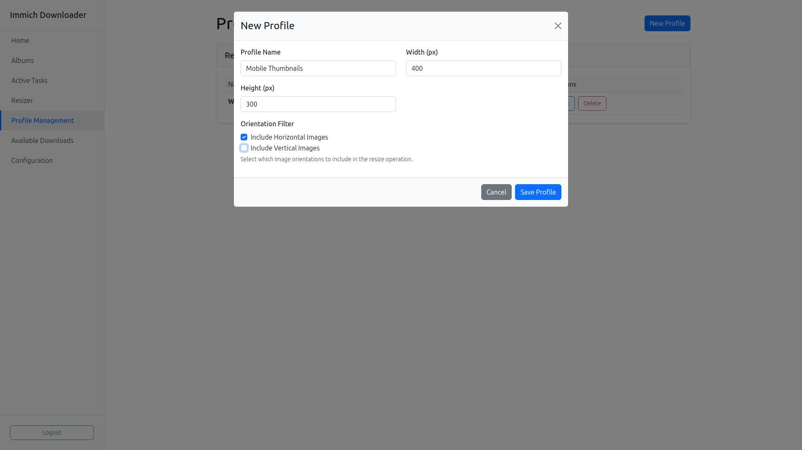
*Create custom resize profiles with orientation filtering and dimension controls*

### Resize Workflow Setup
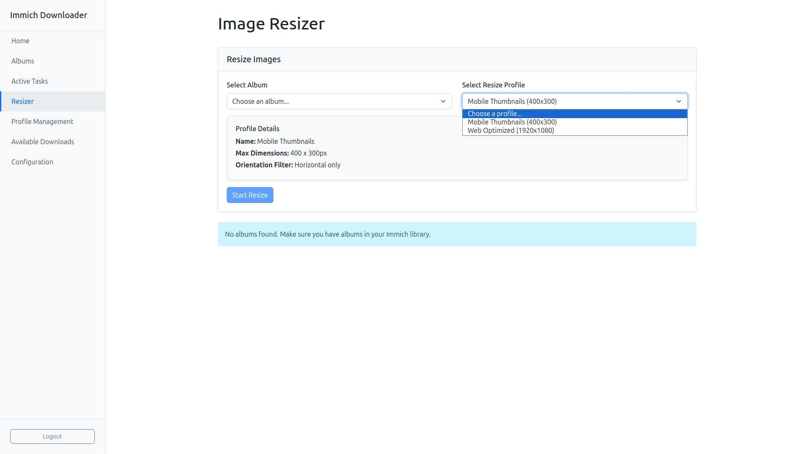
*Select albums and profiles for batch resizing with detailed profile information*

### Updated Profile Management
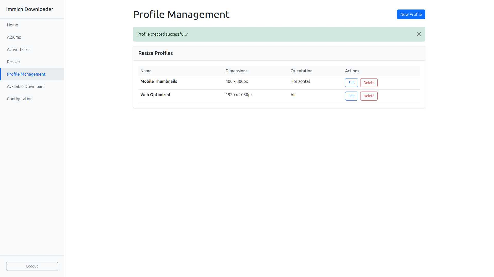
*Manage multiple resize profiles with different dimensions and orientation filters*

### Download Management
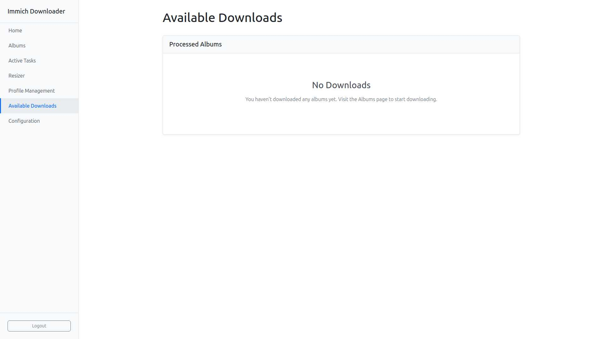
*Track and download processed album archives*

### Mobile-Responsive Interface
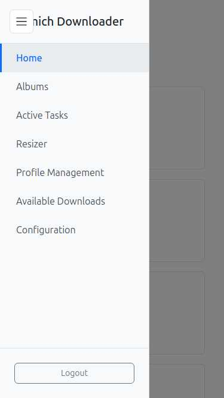
*Fully responsive design optimized for mobile devices*

## 🚀 Quick Start

### Prerequisites
- [Docker](https://docs.docker.com/get-docker/) and [Docker Compose](https://docs.docker.com/compose/install/)
- [Immich](https://immich.app/) server with API access
- Modern web browser (Chrome, Firefox, Safari, Edge)

### 1. Clone Repository
```bash
git clone https://github.com/your-username/immich-downloader.git
cd immich-downloader
```

### 2. Configure Environment
```bash
# Copy environment template
cp .env.example .env

# Edit configuration
nano .env
```

### 3. Start Services
```bash
docker-compose up -d
```

### 4. Access Application
Open your browser to `http://localhost:8080`

## 📦 Installation

### Docker Compose (Recommended)

Create a `docker-compose.yml` file:

```yaml
version: '3.8'

services:
  backend:
    build:
      context: ./backend
      dockerfile: ImmichDownloader.Web/Dockerfile
    environment:
      - ASPNETCORE_ENVIRONMENT=Production
      - JWT_SECRET_KEY=your-256-bit-secret-key-here
      - IMMICH_URL=https://your-immich-server.com
      - IMMICH_API_KEY=your-immich-api-key
      - CONNECTION_STRING=Data Source=/app/data/immich_downloader.db
      - ALLOWED_ORIGINS=http://localhost:8080
    volumes:
      - ./data:/app/data
      - ./downloads:/app/downloads
      - ./resized:/app/resized
    ports:
      - "5000:8080"

  frontend:
    build: ./frontend
    environment:
      - REACT_APP_API_URL=http://localhost:5000
    ports:
      - "3000:80"
    depends_on:
      - backend

  nginx:
    image: nginx:alpine
    ports:
      - "8080:80"
    volumes:
      - ./nginx.conf:/etc/nginx/nginx.conf
    depends_on:
      - frontend
      - backend
```

Then start the services:
```bash
docker-compose up -d
```

### Manual Installation

#### Backend (.NET 9)
```bash
cd backend
dotnet restore
dotnet ef database update --project ImmichDownloader.Web
dotnet run --project ImmichDownloader.Web
```

#### Frontend (React)
```bash
cd frontend
npm install
npm start
```

## ⚙️ Configuration

### Environment Variables

| Variable | Description | Required | Default |
|----------|-------------|----------|---------|
| `JWT_SECRET_KEY` | 256-bit secret key for JWT tokens | ✅ | - |
| `IMMICH_URL` | Immich server URL | ✅ | - |
| `IMMICH_API_KEY` | Immich API key | ✅ | - |
| `CONNECTION_STRING` | Database connection string | ❌ | SQLite default |
| `ALLOWED_ORIGINS` | CORS allowed origins (comma-separated) | ❌ | localhost |
| `DATA_PATH` | Data storage directory | ❌ | `data` |

### Security Best Practices

1. **Generate a secure JWT secret key**:
   ```bash
   openssl rand -base64 32
   ```

2. **Use environment variables for secrets**:
   ```bash
   # .env (add to .gitignore)
   JWT_SECRET_KEY=your-generated-secret-key
   IMMICH_API_KEY=your-immich-api-key
   ```

3. **Configure proper CORS origins**:
   ```
   ALLOWED_ORIGINS=https://yourdomain.com,https://www.yourdomain.com
   ```

## 🏗️ Architecture

### System Overview
```
┌─────────────────┐    ┌──────────────────┐    ┌─────────────────┐
│   React Frontend│    │   .NET Backend   │    │  Immich Server  │
│   (TypeScript)  │◄──►│   (ASP.NET Core) │◄──►│   (External)    │
│                 │    │                  │    │                 │
│ • UI Components │    │ • REST API       │    │ • Photo Storage │
│ • SignalR Client│    │ • SignalR Hub    │    │ • Album API     │
│ • State Mgmt    │    │ • Background Jobs│    │ • Asset API     │
└─────────────────┘    └──────────────────┘    └─────────────────┘
         │                       │
         │              ┌─────────────────┐
         └──────────────►│   File System   │
                         │                 │
                         │ • Download Cache│
                         │ • Resized Images│
                         │ • SQLite DB     │
                         └─────────────────┘
```

### Technology Stack

#### Backend (.NET 9)
- **ASP.NET Core**: Web API framework
- **Entity Framework Core**: ORM for database operations
- **SignalR**: Real-time communication
- **ImageSharp**: Image processing with HEIC support
- **SQLite**: Database engine
- **JWT Bearer**: Authentication

#### Frontend (React 18)
- **TypeScript**: Type-safe JavaScript
- **Bootstrap**: UI framework for responsive design
- **SignalR Client**: Real-time updates
- **Axios**: HTTP client for API communication

#### Key Components

**Backend Services:**
- `StreamingDownloadService`: Memory-efficient download processing
- `StreamingResizeService`: Image processing with streaming I/O
- `ImageProcessingService`: EXIF handling and format conversion
- `TaskProgressService`: Real-time progress notifications
- `AuthService`: JWT authentication and user management
- `ImmichService`: External API communication

**Frontend Components:**
- `Albums`: Album browsing with sync indicators
- `ActiveTasks`: Real-time progress monitoring
- `ProfileManagement`: Resize profile configuration
- `AvailableDownloads`: Completed download management

## 🔧 Development

### Prerequisites
- [.NET 9 SDK](https://dotnet.microsoft.com/download)
- [Node.js 18+](https://nodejs.org/)
- [Visual Studio](https://visualstudio.microsoft.com/) or [VS Code](https://code.visualstudio.com/)

### Backend Development
```bash
cd backend
dotnet restore
dotnet ef database update --project ImmichDownloader.Web
dotnet run --project ImmichDownloader.Web
```

### Frontend Development
```bash
cd frontend
npm install
npm start
```

### Database Migrations
```bash
cd backend
dotnet ef migrations add MigrationName --project ImmichDownloader.Web
dotnet ef database update --project ImmichDownloader.Web
```

### Running Tests
```bash
# Backend tests
cd backend
dotnet test

# Frontend tests  
cd frontend
npm test
```

## 📝 API Documentation

### Authentication

#### POST `/api/auth/register`
Register a new user account.

**Request:**
```json
{
  "username": "admin",
  "password": "SecurePass123!"
}
```

**Response:** `200 OK` or validation errors

#### POST `/api/auth/login`
Authenticate and receive JWT token.

**Response:**
```json
{
  "access_token": "eyJhbGciOiJIUzI1NiIs...",
  "token_type": "Bearer"
}
```

### Album Management

#### GET `/api/albums`
List available albums from Immich server.

**Response:**
```json
[
  {
    "id": "550e8400-e29b-41d4-a716-446655440000",
    "albumName": "Family Photos",
    "description": "Summer vacation 2024",
    "assetCount": 156,
    "localAssetCount": 0
  }
]
```

### Downloads

#### POST `/api/download`
Start album download task.

**Request:**
```json
{
  "AlbumId": "550e8400-e29b-41d4-a716-446655440000",
  "AlbumName": "Family Photos"
}
```

**Response:**
```json
{
  "task_id": "download-task-uuid"
}
```

#### GET `/api/downloads/{taskId}`
Download completed ZIP file.

**Response:** Binary ZIP file stream with HTTP range support

### Task Management

#### GET `/api/tasks`
Get all background tasks with progress.

**Response:**
```json
[
  {
    "id": "task-uuid",
    "taskType": "Download",
    "status": "InProgress", 
    "progress": 45,
    "total": 100,
    "currentStep": "Downloading photos...",
    "createdAt": "2024-01-15T10:30:00Z"
  }
]
```

## 🤝 Contributing

We welcome contributions! Please follow these guidelines:

### Getting Started
1. Fork the repository
2. Clone your fork: `git clone https://github.com/your-username/immich-downloader.git`
3. Create a feature branch: `git checkout -b feature/amazing-feature`
4. Install dependencies (see [Development](#development))

### Code Standards
- **C# (.NET)**: Use file-scoped namespaces, add XML documentation for public members
- **TypeScript/React**: Follow ESLint rules, use TypeScript types
- **Single Responsibility**: Follow SOLID principles
- **Testing**: Include unit tests for new features
- **Mobile First**: Ensure UI changes are mobile-responsive

### Submitting Changes
1. Commit your changes: `git commit -m 'Add amazing feature'`
2. Push to the branch: `git push origin feature/amazing-feature`
3. Open a Pull Request with:
   - Clear description of changes
   - Screenshots for UI changes
   - Test coverage information

## 🐛 Issues & Support

- **Bug Reports**: [GitHub Issues](https://github.com/your-username/immich-downloader/issues)
- **Feature Requests**: [GitHub Discussions](https://github.com/your-username/immich-downloader/discussions)
- **Documentation**: [Wiki](https://github.com/your-username/immich-downloader/wiki)

## 📄 License

This project is licensed under the Apache License 2.0 - see the [LICENSE](LICENSE) file for details.

## 🙏 Acknowledgments

- [Immich](https://immich.app/) - The amazing self-hosted photo management solution
- [ImageSharp](https://sixlabors.com/products/imagesharp/) - Cross-platform image processing
- [SignalR](https://docs.microsoft.com/en-us/aspnet/core/signalr/) - Real-time web functionality
- [React](https://reactjs.org/) - Frontend framework
- [Bootstrap](https://getbootstrap.com/) - UI components

## 📊 Project Status

This project is actively maintained. See the [roadmap](https://github.com/your-username/immich-downloader/projects) for upcoming features.

---

<div align="center">

**Star ⭐ this repo if you find it helpful!**

Made with ❤️ for the Immich community

</div>