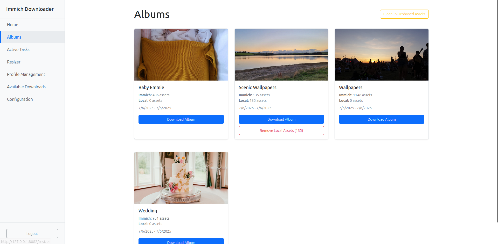

# Immich Downloader

<div align="center">

**A modern web application for downloading and resizing photos from Immich servers with real-time progress tracking.**

[](https://dotnet.microsoft.com/)
[](https://reactjs.org/)
[](https://www.typescriptlang.org/)
[](https://www.docker.com/)
[](LICENSE)

[Overview](#overview--features) • [Quick Start](#quick-start) • [Installation](#installation) • [Configuration](#configuration) • [API Documentation](#api-documentation) • [Contributing](#contributing)

</div>

## 📖 Overview & Features

Immich Downloader is a specialized web application for downloading and processing photos from [Immich](https://immich.app/) servers, designed specifically for **photo frames and wallpaper creation**. It excels at batch processing albums with **intelligent black border padding** to maintain aspect ratios without cropping.

### 🎯 Core Capabilities
- **Photo Frame Processing**: Create uniformly sized images with intelligent letterboxing/pillarboxing
- **Custom Quality Control**: Adjustable JPEG quality (1-100%) and orientation filtering
- **Streaming Architecture**: Memory-efficient processing for albums of any size
- **Incremental Sync**: Smart detection of new photos on subsequent downloads
- **Real-time Progress**: Live updates with mobile-responsive interface
- **Production Ready**: Docker deployment with JWT authentication and comprehensive security

## 🖼️ Interface Preview

### Main Dashboard


*Clean, modern interface showing album overview and recent activity*

### Album Management



### Tasks


### Resize


### Download


## 🚀 Quick Start

### Prerequisites
- [Docker](https://docs.docker.com/get-docker/) and [Docker Compose](https://docs.docker.com/compose/install/)
- [Immich](https://immich.app/) server with API access
- Modern web browser (Chrome, Firefox, Safari, Edge)

### 1. Clone Repository
```bash
git clone https://github.com/dan-jeff/immich-album-downloader.git
cd immich-downloader
```

### 2. Start Services
```bash
docker-compose up -d
```

### 3. Access Application
Open your browser to `http://localhost:8082`

## 📦 Installation

The application includes a pre-configured Docker Compose setup for easy deployment.

### Using the Included Setup

The repository includes everything needed to run the application:

```bash
# Clone and start
git clone https://github.com/dan-jeff/immich-album-downloader.git
cd immich-downloader
docker-compose up -d

# Access at http://localhost:8082
```

### Custom Installation

For advanced users who want to customize the deployment, see the [Technical Architecture](#technical-architecture) section for detailed setup instructions.

## ⚙️ Configuration

### Initial Setup

1. **Start the application** using Docker Compose
2. **Create your account** on the setup page
3. **Configure Immich connection**:
   - Go to Configuration page
   - Enter your Immich server URL (e.g., `https://immich.example.com`)
   - Enter your Immich API key (found in Immich → Account Settings → API Keys)
   - Click "Test Connection" to verify
   - Save the configuration

### Security Notes

- **Immich settings are stored securely** in the application database
- **Generate a strong JWT secret** for production deployments
- **All configuration is done through the web interface** - no manual file editing required

## 🔧 Development

### Prerequisites
- [.NET 9 SDK](https://dotnet.microsoft.com/download)
- [Node.js 18+](https://nodejs.org/)
- [Visual Studio](https://visualstudio.microsoft.com/) or [VS Code](https://code.visualstudio.com/)

### Backend Development
```bash
cd backend
dotnet restore
dotnet ef database update --project ImmichDownloader.Web
dotnet run --project ImmichDownloader.Web
```

### Frontend Development
```bash
cd frontend
npm install
npm start
```

### Database Migrations
```bash
cd backend
dotnet ef migrations add MigrationName --project ImmichDownloader.Web
dotnet ef database update --project ImmichDownloader.Web
```

### Running Tests
```bash
# Backend tests (268 tests with 100% pass rate)
cd backend
dotnet test

# Run component tests specifically
dotnet test --filter "Category=ComponentTest"

# Run security tests
dotnet test --filter "TestCategory=Security"

# Frontend tests  
cd frontend
npm test
```

## 📝 API Documentation

### Authentication

#### POST `/api/auth/register`
Register a new user account.

**Request:**
```json
{
  "username": "admin",
  "password": "SecurePass123!"
}
```

**Response:** `200 OK` or validation errors

#### POST `/api/auth/login`
Authenticate and receive JWT token.

**Response:**
```json
{
  "access_token": "eyJhbGciOiJIUzI1NiIs...",
  "token_type": "Bearer"
}
```

### Album Management

#### GET `/api/albums`
List available albums from Immich server.

**Response:**
```json
[
  {
    "id": "550e8400-e29b-41d4-a716-446655440000",
    "albumName": "Family Photos",
    "description": "Summer vacation 2024",
    "assetCount": 156,
    "localAssetCount": 0
  }
]
```

### Downloads

#### POST `/api/download`
Start album download task.

**Request:**
```json
{
  "AlbumId": "550e8400-e29b-41d4-a716-446655440000",
  "AlbumName": "Family Photos"
}
```

**Response:**
```json
{
  "task_id": "download-task-uuid"
}
```

#### GET `/api/downloads/{taskId}`
Download completed ZIP file.

**Response:** Binary ZIP file stream with HTTP range support

### Task Management

#### GET `/api/tasks`
Get all background tasks with progress.

**Response:**
```json
[
  {
    "id": "task-uuid",
    "taskType": "Download",
    "status": "InProgress", 
    "progress": 45,
    "total": 100,
    "currentStep": "Downloading photos...",
    "createdAt": "2024-01-15T10:30:00Z"
  }
]
```

## 🏗️ Technical Architecture

### System Overview
```
┌─────────────────┐    ┌──────────────────┐    ┌─────────────────┐
│   React Frontend│    │   .NET Backend   │    │  Immich Server  │
│   (TypeScript)  │◄──►│   (ASP.NET Core) │◄──►│   (External)    │
│                 │    │                  │    │                 │
│ • UI Components │    │ • REST API       │    │ • Photo Storage │
│ • SignalR Client│    │ • SignalR Hub    │    │ • Album API     │
│ • State Mgmt    │    │ • Background Jobs│    │ • Asset API     │
└─────────────────┘    └──────────────────┘    └─────────────────┘
         │                       │
         │              ┌─────────────────┐
         └──────────────►│   File System   │
                         │                 │
                         │ • Download Cache│
                         │ • Resized Images│
                         │ • SQLite DB     │
                         └─────────────────┘
```

### Technology Stack

#### Backend (.NET 9)
- **ASP.NET Core**: Web API framework
- **Entity Framework Core**: ORM for database operations
- **SignalR**: Real-time communication
- **ImageSharp**: Image processing with HEIC support
- **SQLite**: Database engine
- **JWT Bearer**: Authentication

#### Frontend (React 18)
- **TypeScript**: Type-safe JavaScript
- **Bootstrap**: UI framework for responsive design
- **SignalR Client**: Real-time updates
- **Axios**: HTTP client for API communication

### Key Components

**Backend Services:**
- `StreamingDownloadService`: Memory-efficient download processing with disk-based streaming
- `StreamingResizeService`: Image processing with streaming I/O to prevent memory overflow
- `ImageProcessingService`: Smart resizing with black border padding, EXIF handling, HEIC support, and configurable JPEG quality (1-100%)
- `TaskExecutor`: Background task management with bounded queuing for concurrent processing
- `AuthService`: JWT authentication with BCrypt password hashing and secure session management
- `ImmichService`: External API communication with database-stored configuration for seamless integration
- `SecureFileService`: Safe file operations with comprehensive path traversal protection
- `DatabaseService`: Centralized database operations with proper scoping and incremental sync support

**Frontend Components:**
- `Navigation`: Responsive sidebar with mobile-optimized header layout and touch-friendly interface
- `Albums`: Album browsing with visual sync indicators and thumbnail preview support
- `ActiveTasks`: Real-time progress monitoring with live SignalR updates
- `ProfileManagement`: Resize profile configuration with quality sliders and orientation filtering
- `AvailableDownloads`: Completed download management with descriptive filenames (album + profile)
- `Configuration`: Web-based setup for seamless Immich server connection and testing

### Environment Variables

| Variable | Description | Required | Default |
|----------|-------------|----------|---------|
| `JWT_SECRET_KEY` | 256-bit secret key for JWT tokens | ✅ | - |
| `CONNECTION_STRING` | Database connection string | ❌ | SQLite default |
| `ALLOWED_ORIGINS` | CORS allowed origins (comma-separated) | ❌ | localhost |
| `DATA_PATH` | Data storage directory | ❌ | `data` |

### Manual Development Setup

#### Backend (.NET 9)
```bash
cd backend
dotnet restore
dotnet ef database update --project ImmichDownloader.Web
dotnet run --project ImmichDownloader.Web
```

#### Frontend (React)
```bash
cd frontend
npm install
npm start
```

## 🤝 Contributing

We welcome contributions! Please follow these guidelines:

### Getting Started
1. Fork the repository
2. Clone your fork: `git clone https://github.com/dan-jeff/immich-album-downloader.git`
3. Create a feature branch: `git checkout -b feature/amazing-feature`
4. Install dependencies (see [Development](#development))

### Code Standards
- **C# (.NET)**: Use file-scoped namespaces, add XML documentation for public members
- **TypeScript/React**: Follow ESLint rules, use TypeScript types
- **Single Responsibility**: Follow SOLID principles
- **Testing**: Include unit tests for new features
- **Mobile First**: Ensure UI changes are mobile-responsive

### Submitting Changes
1. Commit your changes: `git commit -m 'Add amazing feature'`
2. Push to the branch: `git push origin feature/amazing-feature`
3. Open a Pull Request with:
   - Clear description of changes
   - Screenshots for UI changes
   - Test coverage information

## 🐛 Issues & Support

- **Bug Reports**: [GitHub Issues](https://github.com/dan-jeff/immich-album-downloader/issues)
- **Feature Requests**: [GitHub Discussions](https://github.com/dan-jeff/immich-album-downloader/discussions)
- **Documentation**: [Wiki](https://github.com/dan-jeff/immich-album-downloader/wiki)

## 📄 License

This project is licensed under the Apache License 2.0 - see the [LICENSE](LICENSE) file for details.

## 🙏 Acknowledgments

- [Immich](https://immich.app/) - The amazing self-hosted photo management solution
- [ImageSharp](https://sixlabors.com/products/imagesharp/) - Cross-platform image processing
- [SignalR](https://docs.microsoft.com/en-us/aspnet/core/signalr/) - Real-time web functionality
- [React](https://reactjs.org/) - Frontend framework
- [Bootstrap](https://getbootstrap.com/) - UI components

---

<div align="center">

**Star ⭐ this repo if you find it helpful!**

Made with ❤️ for the Immich community

</div>